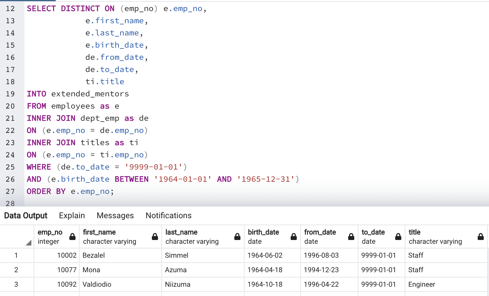
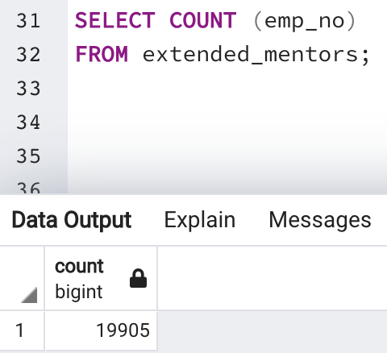

# Pewlett-Hackard-Analysis
## Overview
The company, Pewlett Hackard, is preparing for a "silver tsumani" in which thousands of employees are readying themselves for retirement. In order to best prepare for upcoming exodus, the company requests the number of employees retiring per deparment and the employees who are eligible to participate in a mentorship program. Using PostgreSQL and pgAdmin 4 to write queries, data will be filtered and new tables will provide the company with the desired information.   

## Results

### The Number of Retiring Employees by Title
#### Retirement Titles
Due to the incredibly large amount of employees leaving the company in the near future Pewlett Hackard wants the total number of employees in every department tallied. This analysis will be completed in three steps. First, all of the employee identification numbers are collected with their corresponding department and the dates holding this position. In pgAdmin 4, these data can be callcted through query statements. Pulling data columns from multiple datasets and constructing new tables allow us to view the desired data from many locations into one. 

#### Unique Titles
After outputting the data, it is immediately clear that there are duplicate entries for some workers due to a change in position or a promotion. In order to remove these vaules, the DISTINCT ON statement on the column "emp_no" (employee number) will remove any duplicate entries for a single employee. The new table contains the employee number, their full name, and the latest position held at the company. 

#### Retiring Titles
The final step in the first part of the analysis is separating all of the employees into thei respected departments at Pewlett Hackard. By solely retrieving the number of titles using the COUNT () clause on "emp_no", a new data table can be made containging the number of employees per department. Now a clear and concise table is available with the number of employees retiring in every department at the company.

### The Employees Eligible for the Mentorship Program
This part of the analysis calls for the employees born during the year 1965. These workers qualify for the new Mentorship Program at Pewlett Hackard that will not only help the company identfy future retirees, but it will also provide entry-level workers with a "Mentor" in order to set them off with all the support they might need. In this query, the WHERE clause filters the "to_date" and the "birth_date" to record current employees born during the year 1965. 

## Summary
### The Impact of the Silver Tsunami
Using the SUM () clause on the "retiring_titles" table, we see that there are 90,398 employees nearing retiremnt in the near future. By implementing the COUNT() clause on the "mentorship_eligibility" table, we see only 1,549 of those employees are eligible for the mentorship program. That leaves 88,849 employees ready to retiring. If all available positions are filled each mentor would have up to 54 employees for the next generation to assist.  

In order to help Pewlett Hackard combat this dilemma, we can change the query for the "mentorship_eligibility" by adding employees born during the years 1964-1965. This will add many more potential mentors, in total: 19,905. Each mentor would have 4-5 new employees to guide from the new generation. By adjusting the query after the conditional AND () to the year 1964, we can generate a new table called "extended_mentors". 

Inserting the COUNT () clause on the new table "extended_mentors" lets us see that their are now 19,905 new mentors which will take on far fewer incoming employees in the mentorship program at the company. If Pewlett Hackard extend the mentorship program to employees born during the years 1964-1965 it will be well equipped to handle the almost 90,000 new employees after the impact of the devastating "Silver Tsunami". 

